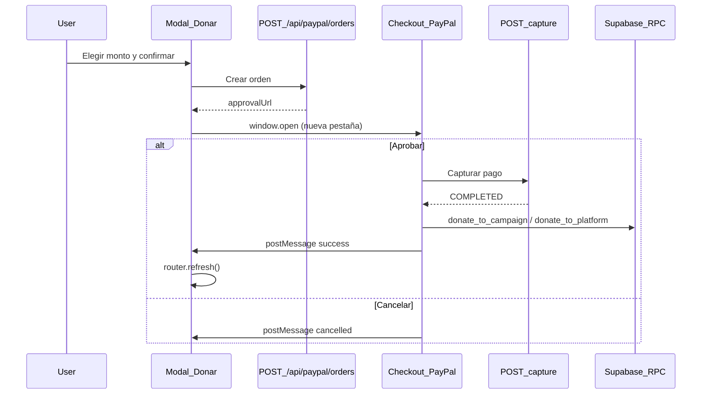

# Integración PayPal Sandbox — Kany

Guía paso a paso para donaciones con PayPal en modo **simulado** (demo del hackathon) o **sandbox real** (PayPal Developer).

## Resumen del flujo



---

## 1. Prerrequisitos

- Node.js y dependencias del proyecto instaladas (`pnpm install`)
- Supabase configurado con migraciones aplicadas (incluye `011_donate_to_campaign` y `012_platform_donations`)
- Cuenta demo o usuario autenticado para donar
- Para **modo simulado**: no se requieren credenciales PayPal
- Para **modo sandbox real**: cuenta en [PayPal Developer](https://developer.paypal.com/)

---

## 2. Variables de entorno

Copia `.env.example` a `.env.local` y configura:

| Variable | Requerida | Descripción |
|----------|-----------|-------------|
| `PAYPAL_MODE` | No (default: `simulated`) | `simulated` = pestaña mock local; `sandbox` = PayPal real |
| `PAYPAL_CLIENT_ID` | Solo en `sandbox` | Client ID de la app REST en Sandbox |
| `PAYPAL_CLIENT_SECRET` | Solo en `sandbox` | Secret de la app REST en Sandbox |
| `PAYPAL_BASE_URL` | No | Default: `https://api-m.sandbox.paypal.com` |
| `NEXT_PUBLIC_APP_URL` | Sí | URL base de la app (ej. `http://localhost:3000`) |
| `SUPABASE_SERVICE_ROLE_KEY` | Recomendada | Firma tokens de órdenes simuladas (fallback si falta) |

Ejemplo para demo del hackathon:

```env
PAYPAL_MODE=simulated
NEXT_PUBLIC_APP_URL=http://localhost:3000
NEXT_PUBLIC_SUPABASE_URL=https://tu-proyecto.supabase.co
NEXT_PUBLIC_SUPABASE_ANON_KEY=tu-anon-key
SUPABASE_SERVICE_ROLE_KEY=tu-service-role-key
```

Ejemplo para sandbox real:

```env
PAYPAL_MODE=sandbox
PAYPAL_CLIENT_ID=tu-client-id-sandbox
PAYPAL_CLIENT_SECRET=tu-client-secret-sandbox
PAYPAL_BASE_URL=https://api-m.sandbox.paypal.com
NEXT_PUBLIC_APP_URL=http://localhost:3000
```

---

## 3. Modo simulado (demo hackathon)

Ideal para la demo sin credenciales PayPal.

### Pasos

1. Asegura `PAYPAL_MODE=simulated` en `.env.local`
2. Inicia la app: `pnpm dev`
3. Inicia sesión (ej. `demo.usuario@kany.sv` / `DemoKany2026!`)
4. Ve a `/donaciones`
5. Haz clic en **Donar** en una campaña o **Donar a la plataforma**
6. Elige monto y **Continuar con PayPal**
7. Se abre una pestaña con UI estilo PayPal Sandbox (simulado)
8. **Pagar ahora** → registra la donación y cierra la pestaña
9. **Cancelar** → vuelve sin registrar donación

### Qué verificar

- Campaña: barra de progreso y contador de donantes suben
- Plataforma: registro en tabla `platform_donations` (Supabase Table Editor)
- Toast de éxito/cancelación en la página principal

---

## 4. Modo sandbox real (PayPal Developer)

### 4.1 Crear app en PayPal Developer

1. Entra a [developer.paypal.com](https://developer.paypal.com/) e inicia sesión
2. **Dashboard** → **Apps & Credentials**
3. Pestaña **Sandbox** → **Create App**
4. Nombre: `Kany Donations` (o similar)
5. Copia **Client ID** y **Secret**

### 4.2 Cuentas de prueba

En **Sandbox** → **Accounts** verás cuentas Personal y Business de prueba. Usa la Personal para pagar como donante.

### 4.3 Configurar `.env.local`

```env
PAYPAL_MODE=sandbox
PAYPAL_CLIENT_ID=...
PAYPAL_CLIENT_SECRET=...
```

Reinicia el servidor de desarrollo tras cambiar variables.

### 4.4 Probar

1. Donar en `/donaciones` → se abre `sandbox.paypal.com`
2. Inicia sesión con cuenta Personal de prueba
3. Aprueba el pago
4. Redirige a `/donaciones/paypal/return` → captura + RPC → cierra pestaña
5. Verifica progreso de campaña actualizado

---

## 5. Migraciones de base de datos

Ejecuta en Supabase SQL Editor (o `pnpm db:reset` en local):

| Migración | Propósito |
|-----------|-----------|
| `20240706130100_011_donate_to_campaign.sql` | RPC `donate_to_campaign` |
| `20240706130200_012_platform_donations.sql` | Tabla + RPC `donate_to_platform` |

Verifica que existan:

```sql
select routine_name from information_schema.routines
where routine_schema = 'public'
  and routine_name in ('donate_to_campaign', 'donate_to_platform');
```

---

## 6. Archivos clave del código

| Archivo | Rol |
|---------|-----|
| `lib/paypal.ts` | Dual mode: simulado vs sandbox |
| `lib/donations/use-paypal-donation.ts` | Hook: crear orden + popup + postMessage |
| `lib/donations/complete-donation.ts` | RPC post-captura |
| `app/api/paypal/orders/route.ts` | Crear orden |
| `app/api/paypal/orders/[orderId]/capture/route.ts` | Capturar pago |
| `app/donaciones/paypal/checkout/page.tsx` | UI mock (solo simulado) |
| `app/donaciones/paypal/return/page.tsx` | Retorno sandbox real |
| `components/donations/donate-button.tsx` | Donar a campaña |
| `components/donations/site-donate-button.tsx` | Donar a plataforma |

---

## 7. Troubleshooting

| Problema | Solución |
|----------|----------|
| Popup bloqueado | Permite popups para `localhost` en el navegador |
| "PayPal sandbox requiere PAYPAL_CLIENT_ID..." | Usa `PAYPAL_MODE=simulated` o agrega credenciales |
| Donar falla "Not authenticated" | Inicia sesión antes de donar |
| RPC `donate_to_campaign` no existe | Aplica migración 011 |
| RPC `donate_to_platform` no existe | Aplica migración 012 |
| Token simulado inválido/expirado | Tokens duran 30 min; crea nueva orden |
| Progreso no actualiza | Verifica que la pestaña hijo completó el pago; recarga `/donaciones` |
| PayPal auth failed | Revisa Client ID/Secret y que la app esté en Sandbox |

---

## 8. Checklist pre-demo (jurado)

- [ ] Migraciones 011 y 012 aplicadas
- [ ] `PAYPAL_MODE=simulated` en `.env.local`
- [ ] `NEXT_PUBLIC_APP_URL` correcto
- [ ] Cuentas demo creadas (`pnpm seed:demo`)
- [ ] Login con `demo.usuario@kany.sv`
- [ ] Probar donación a campaña → barra sube
- [ ] Probar cancelación → mensaje sin cambio en progreso
- [ ] Probar donación a plataforma

---

## 9. Producción (futuro)

1. Crear app **Live** en PayPal Developer
2. Cambiar credenciales a Live y `PAYPAL_BASE_URL=https://api-m.paypal.com`
3. Considerar webhooks PayPal para confirmación server-side
4. No usar `PAYPAL_MODE=simulated` en producción
5. Validar montos y registrar auditoría de transacciones

---

## 10. Referencias

- [PayPal Checkout Orders API](https://developer.paypal.com/docs/api/orders/v2/)
- [PayPal Sandbox Testing](https://developer.paypal.com/tools/sandbox/)
- Demo jurado: [`docs/DEMO_JURADO.md`](./DEMO_JURADO.md)
